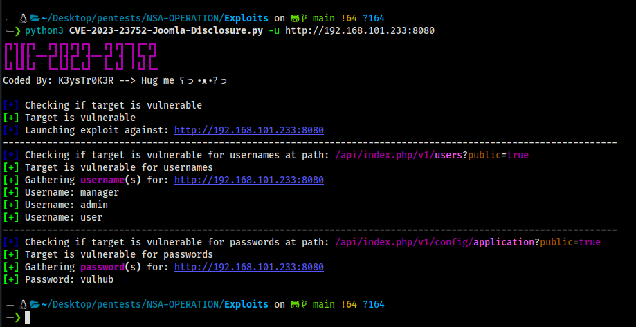

# CVE-2023-23752 - Joomla Improper Access Check

An issue has been identified in Joomla versions 4.0.0 through 4.2.7. This vulnerability relates to an improper access check within the application, enabling unauthorized access to critical webservice endpoints.

# Proof of Concept (PoC)

A Proof of Concept (PoC) demonstrating this vulnerability is available. Please note that this PoC is for educational purposes only and should not be used in any unauthorized manner. Its use against systems without proper authorization is illegal!

# Disclaimer 
This PoC is provided strictly for educational purposes and ethical security research. Usage against any system without explicit permission is illegal and unethical.
